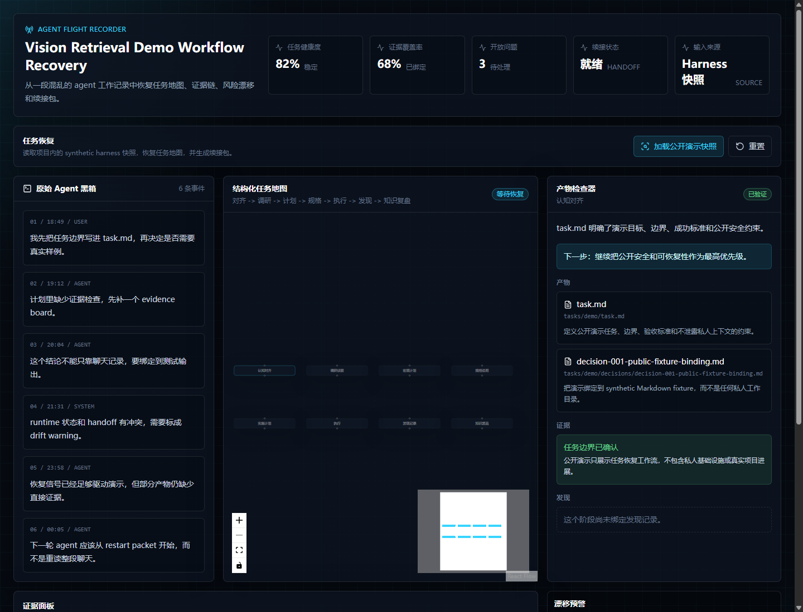

# Agent Flight Recorder

Agent Flight Recorder turns messy long-running AI agent work into a structured mission map with plans, evidence, findings, drift warnings, and a restart packet.



## What It Shows

Agent Flight Recorder is a lightweight, document-native visualization demo for agent workflow continuity. It takes Agent Harness-style task records and presents them as:

- A structured task map
- Evidence-linked artifact inspection
- Drift and missing-context warnings
- A restart packet for the next agent
- A side-by-side contrast between raw agent logs and recovered task state

The app starts with a built-in synthetic mission. Use the snapshot loading button to recover a mission from the synthetic Markdown fixture in `public/sample-data/agent-harness-task/`.

## Why It Matters

Most agent tools focus on execution: prompts, tools, routing, and runtime automation.

Agent Flight Recorder focuses on continuity: what the task is, what has been proven, what is still open, where state has drifted, and how another agent can resume without rereading a long transcript.

## Local Run

```bash
npm install
npm run dev
```

## Build

```bash
npm run build
```

For GitHub Pages or any deployment under a repository subpath, set the Vite base path:

```bash
VITE_BASE_PATH=/Agent-Flight-Recorder/ npm run build
```

PowerShell:

```powershell
$env:VITE_BASE_PATH="/Agent-Flight-Recorder/"; npm.cmd run build
```

## Project Structure

- `src/domain/`: mission model, health scoring, and graph conversion
- `src/data/`: built-in demo data and synthetic snapshot loader
- `src/components/`: cockpit UI surfaces
- `public/sample-data/agent-harness-task/`: synthetic task snapshot for the one-click demo
- `docs/demo.png`: current demo screenshot
- `docs/superpowers/`: design spec

## Public Snapshot Note

The bundled snapshot is a synthetic public fixture. It preserves the shape of an Agent Harness task without exposing private infrastructure, private project context, or operator-specific data.
